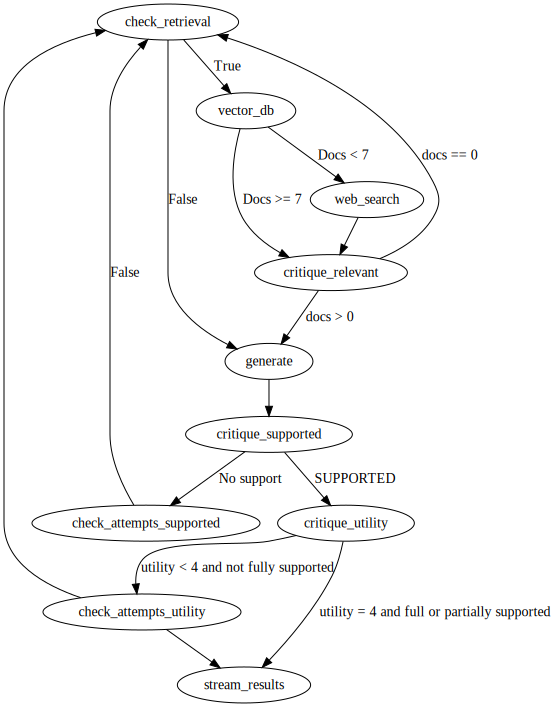

# Medical Conversational Evidence Based Self-reflection Agents

Large language models (LLMs) have recently shown remarkable abilities in conversational question answering and generating human-like text, leading to growing interest in their healthcare applications. Despite not being specifically designed for medical use, LLMs have the potential to transform care delivery by improving patient report documentation, enhancing diagnostic accuracy, and supporting various clinical tasks.


# Content

#### [Setup](#setup-&-installation)
#### [Self-Reflection Workflow](#self-reflection-workflow)
#### [Self-Reflection Tokens](#self-reflection-tokens)
#### [Self-Reflection Training](#self-reflection-training)
#### [Self-Reflection Evaluation](#self-reflection-evaluation)
#### [Level of Evidence](#level-of-evidence)

# Setup & Installation

```
conda env create -f environment.yml
conda activate self-reflective-llm
```

### Create embeddings
```
python create_medical_records_index.py
```

### Web Inference
```
./server.sh
```
### using gunicorn
```
./server.sh prod
```

### Test inference
```
python run.py
```

### Web client
requires node 16+
```
cd client
npm install
npm run dev --  --host
```

# Self-Reflection Workflow


# Self-Reflection Tokens

<table style="font-size:12px;">
  <tr>
    <th>Token</th>
    <th>Description</th>
    <th>Input</th>
    <th>Output</th>
  </tr>
  <tr>
    <td>Retrieve Token</td>
    <td>Determines whether to retrieve document chunks</td>
    <td>x (question), optional y (generation)</td>
    <td>Yes, No, or Continue</td>
  </tr>
  <tr>
    <td>ISREL Token</td>
    <td>Decides whether passages D are relevant to x</td>
    <td>x (question), d (chunk) for d in D</td>
    <td>Relevant or Irrelevant</td>
  </tr>
  <tr>
    <td>ISSUP Token</td>
    <td>Determines whether the LLM generation from each chunk in D is relevant to the chunk</td>
    <td>x (question), d (chunk), y (generation) for d in D</td>
    <td>Fully Supported, Partially Supported, No Support</td>
  </tr>
  <tr>
    <td>ISUSE Token</td>
    <td>Decides whether generation from each chunk in D is a useful response to x</td>
    <td>x (question), y (generation) for d in D</td>
    <td>5, 4, 3, 2, 1 (rating scale indicating usefulness)</td>
  </tr>
</table>

# Self-Reflection Training

training a Language Model (LLM) to generate self-reflection tokens that govern various stages in the Self-Retrieval-Augmented Generation process.

The training process involves three models: Retriever, Critic, and Generator, beginning with a dataset of prompts and responses, enhanced by reflection and critique tokens.

1- Retriever Data Creation: Generating training data for the Retriever model using GPT-4.
2- Critic Data Creation: Generating training data for the Critic model using GPT-4.
3- Critic Training: Training the Critic model with new special tokens.
4- Generator Data Creation: Generating training data for the Generator model using outputs from the Critic and Retriever models.
5- Generator Training: Training the Generator model with new special tokens.

# Self-Reflection Evaluation

The evaluation process assessed the model's ability to generate accurate and relevant responses by testing it with questions and corresponding contexts. Responses were generated and evaluated based on their relevance, grounding in the provided context, and overall utility. 


# Level of Evidence 
To evaluate how Level of Evidence (LoE) can enhance the trustworthiness and reliability of the model,I use the "Qianjin/PubMedQA dataset", which was augmented with Levels of Evidence (LoE) to train a custom model. This dataset integration was essential for providing a robust training framework . 

you can download our training data at here.
