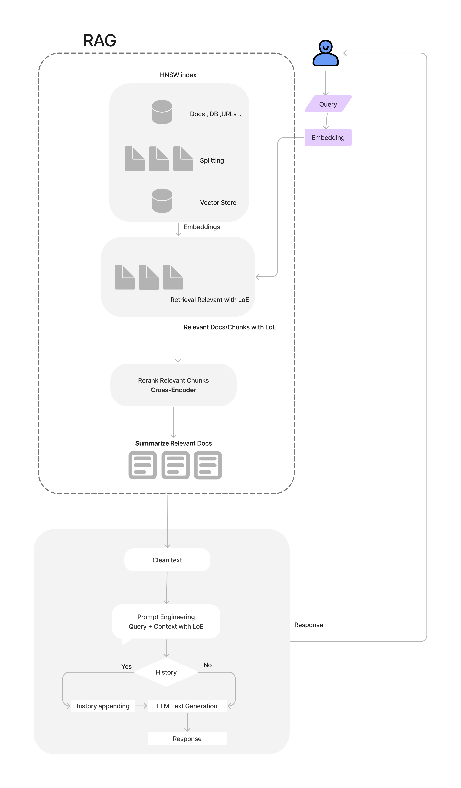

# Content

#### [RAG](#Retrieval-augmented-generation-RAG-models)
#### [RAG Implementation](#rag-implementation)
#### [RAG Workflow](#rah-workflow)
#### [Self Reflection](#self-reflection)
#### [Self Reflection Workflow](#self-reflection-workflow)
#### [Self Reflection Tokens](#self-reflection-tokens)
#### [Self Reflection Training](#self-reflection-training)
#### [Self Reflection Evaluation](#self-reflection-evaluation)
#### [Level of Evidence](#level-of-evidence)

# RAG Implementation:

<h4>Sentence Transformers:</h4>
Encode input sentences into embeddings.
<h4>hnswlib:</h4>
Create an index for efficient similarity search in high-dimensional spaces.
<h4>Nearest neighbor searches:</h4>
Perform searches using a pre-saved search index based on query embeddings.
<h4>Re-ranking:</h4>
Retrieved chunks are re-ranked for relevance using a cross-encoder model.

# RAG Workflow

# Self Reflection
By incorporating self-reflection mechanisms to the Retrieval-Augmented Generation (RAG) framework, we aiming to enhances the quality and coherence of the text it generates. This approach enables AI models to evaluate their own output and refine it over time through self-evaluation. 

# Self Reflection Workflow

# Self Reflection Training

training a Language Model (LLM) to generate self-reflection tokens that govern various stages in the Self-Retrieval-Augmented Generation process.

The training process involves three models: Retriever, Critic, and Generator, beginning with a dataset of prompts and responses, enhanced by reflection and critique tokens.

<h3>Retriever</h3>
<h4>Retriever Data Creation:</h4> Generating training data for the Retriever model using GPT-4.
<h4>Retriever Training:</h4> Training the Retriever model with new special tokens [Retrieve Token].

<h3>Critic</h3>
<h4>Critic Data Creation:</h4> Generating training data for the Critic model using GPT-4.
<h4>Critic Training:</h4> Training the Critic model with new special tokens[ISREL Token][ISSUP Token][ISUSE Token].

<h3>Generator</h3>
<h4>Generator Data Creation:</h4> Generating data for the Generator model using a yes/no question-and-answer dataset "Qianjin/PubMedQA dataset" and enhance it into open-ended questions using GPT-4.
<h4>Generator Training:</h4> Training the Generator model with new dataset.

# Self Reflection Tokens

<table style="font-size:12px;">
  <tr>
    <th>Token</th>
    <th>Description</th>
    <th>Input</th>
    <th>Output</th>
  </tr>
  <tr>
    <td>Retrieve Token</td>
    <td>Determines whether to retrieve document chunks</td>
    <td>x (question), optional y (generation)</td>
    <td>Yes, No, or Continue</td>
  </tr>
  <tr>
    <td>ISREL Token</td>
    <td>Decides whether passages D are relevant to x</td>
    <td>x (question), d (chunk) for d in D</td>
    <td>Relevant or Irrelevant</td>
  </tr>
  <tr>
    <td>ISSUP Token</td>
    <td>Determines whether the LLM generation from each chunk in D is relevant to the chunk</td>
    <td>x (question), d (chunk), y (generation) for d in D</td>
    <td>Fully Supported, Partially Supported, No Support</td>
  </tr>
  <tr>
    <td>ISUSE Token</td>
    <td>Decides whether generation from each chunk in D is a useful response to x</td>
    <td>x (question), y (generation) for d in D</td>
    <td>5, 4, 3, 2, 1 (rating scale indicating usefulness)</td>
  </tr>
</table>

# Self Reflection Evaluation

The evaluation process evaluate the model's ability to generate accurate and relevant responses.

<h4>Prompt and Context Setup:</h4> The evaluation starts with a question (the prompt) and any available relevant information.

<h4>Initial Response Generation:</h4> The model checks if it needs additional information to give a full answer. It decides whether to use "[Retrieval]" or "[No Retrieval]" based on whether more context is needed.

<h4>Retrieval Decision and Response:</h4> If the model needs additional information/ context ("[Retrieval]"), it retrieves the information and uses it to generate a response grounded in the context. If not ("[No Retrieval]"), it answers based on the initial question.

<h4>Scoring and Evaluation:</h4> The responses are scored based on relevance, support, and usefulness. These scores show how well the answers match the provided context and address the questions. Cosine similarity and log probability scores are also used to assess the quality of the responses.

 - Cosine Similarity: This measures how similar the generated response is to the correct answer by comparing them as vectors.

 - Log Probability: This gives insights into how likely the generated response is given the context and the prompt.

<h4>Accuracy Calculation:</h4>The overall performance is summarized by calculating the accuracy of the responses. This is done by comparing the generated answers with the expected ones.

Example Evaluation Results for the Relationship Between Breath Methane Positivity and Delayed Transit Constipation :

| Question                                                                                                  | Prediction                                                                                               | Ground Truth                                                                                                                                                       | Cosine Similarity        |
|----------------------------------------------------------------------------------------------------------|----------------------------------------------------------------------------------------------------------|--------------------------------------------------------------------------------------------------------------------------------------------------------------------|--------------------------|
| What is the relationship between breath methane positivity and delayed transit constipation in patients? | The study found that patients with delayed transit constipation were more likely to be breath methane positive compared to those with normal transit constipation or healthy controls. | Breath methane positivity is more common and higher in patients with objectively proven delayed transit constipation. In fact, the positivity to the lactulose methane breath test (LMBT) was significantly higher in delayed transit patients (58.8%) compared to healthy controls (12.2%) or normal transit patients (13.3%), with delayed transit being the only independent factor for LMBT positivity. | 0.7757343053817749       |

# Level of Evidence 
To see how the Level of Evidence (LoE) can improve the trustworthiness and reliability of our self-reflection model results, we used the "Qianjin/PubMedQA" dataset, which we enhanced with LoE from the PubMed dataset.

Following our self-reflection evaluation process, we measured overall performance by calculating the accuracy of responses. We compared the model's generated answers with the expected ones, both with and without the LoE augmentation, to see the differences in the model's results.
